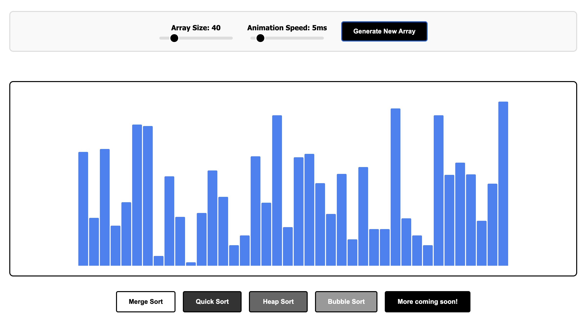
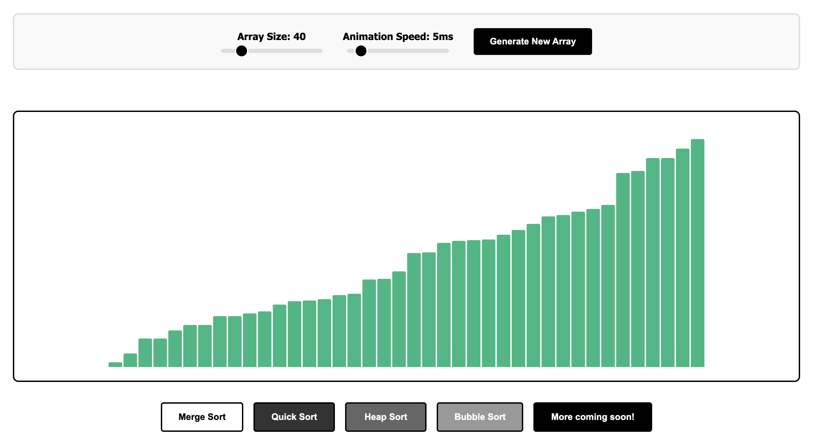

# Sorting Algorithm Visualizer

A simple web application built with React to visualize classic sorting algorithms.

---

## Live Demo

Here's a quick look at the visualizer in action.

**Before Sorting:** A randomly generated, unsorted array.


**After Sorting:** The same array, now sorted, with all bars colored to indicate completion.


---

## Features

*   **Visualize Algorithms**: Watch Merge Sort, Quick Sort, Heap Sort, and Bubble Sort in action.
*   **Interactive Controls**: Fine-tune your visualization experience with two simple sliders:
    *   **Array Size Slider**: Increase or decrease the number of elements in the array to see how algorithm complexity affects performance.
    *   **Animation Speed Slider**: Slow down the animation to carefully observe every step, or speed it up for a quick overview of the sorting process.
*   **Dynamic Data**: Generate a new random array at any time.

---

## How to Run

1.  **Clone the repository:**
    ```bash
    git clone https://github.com/your-username/AlgoVisualizer.git
    cd AlgoVisualizer
    ```

2.  **Install dependencies:**
    ```bash
    npm install
    ```

3.  **Start the development server:**
    ```bash
    npm run dev
    ```

The application will be available at `http://localhost:5173`.

---

## Tech Stack

*   **React**
*   **Vite**
*   **JavaScript**
*   **CSS**